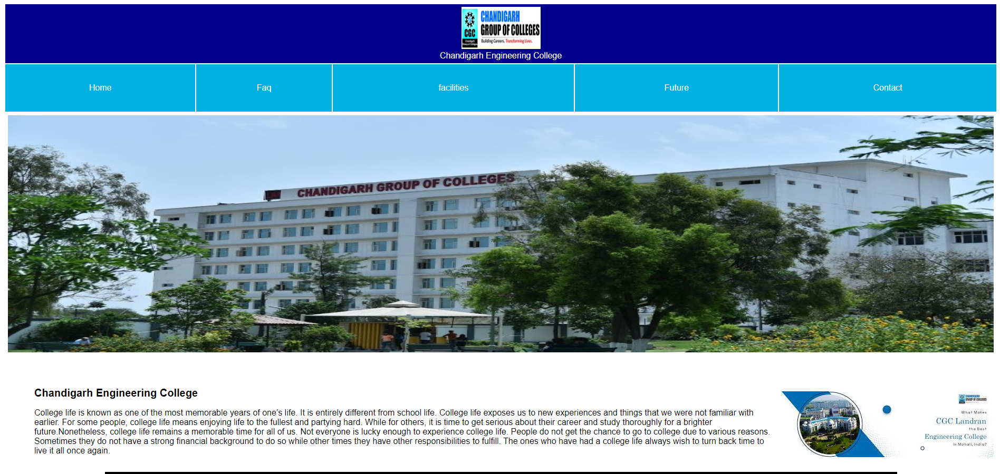

# CGC College Website

Welcome to the CGC College Website! This README file provides an overview of the website, including its structure and instructions for future updates. The website comprises several sections: Homepage, FAQ, Facilities, Contact, and Images. 

## Table of Contents

- [Homepage](#homepage)
- [FAQ](#faq)
- [Facilities](#facilities)
- [Contact](#contact)
- [Images](#images)
- [Credits](#credits)

## Homepage

The homepage serves as the primary landing page for the CGC College website. It provides a brief introduction to the college, highlights key features, and includes navigation links to other sections of the site.

**Key Components:**
- College Introduction
- Key Highlights
- Navigation Menu

## FAQ

The FAQ (Frequently Asked Questions) section addresses common inquiries about the college. It provides answers to questions regarding admissions, programs, campus life, and more.

**Key Components:**
- List of Frequently Asked Questions
- Detailed Answers

## Facilities

The Facilities section showcases the various amenities and resources available at CGC College. This includes information on classrooms, laboratories, libraries, sports facilities, and more.

**Key Components:**
- Overview of Facilities
- Detailed Descriptions
- Photos of Key Facilities

## Contact

The Contact section provides visitors with information on how to get in touch with the college. This includes contact details such as phone numbers, email addresses, and physical addresses. A contact form is also included for easy communication.

**Key Components:**
- Contact Information
- Contact Form

## Images

The Images section includes various photographs of the college, capturing the campus life, events, and infrastructure. 

**Key Components:**
- Photo Gallery
- Image Descriptions

